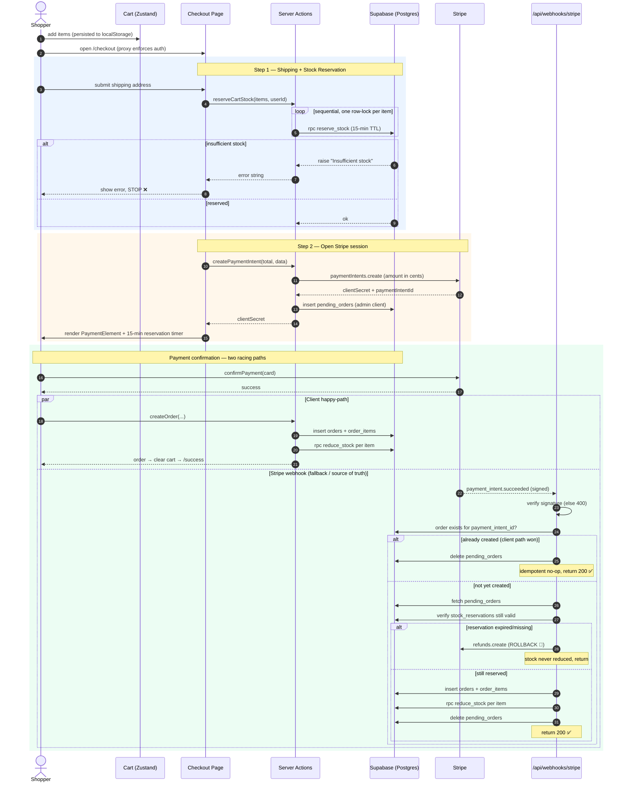

# System Diagrams

Mermaid diagrams of PowerProShop's service topology and checkout/payment flow. For prose explanations see [ARCHITECTURE.md](./ARCHITECTURE.md) and [DATA_FLOW.md](./DATA_FLOW.md).

---

## System Architecture

Topology of the Next.js app and its external services. Notable points:

- **Three Supabase clients** — anon (browser), cookie-bound server client (SSR/actions), and a **service-role admin client** used only where RLS must be bypassed: `createPaymentIntent` and the Stripe webhook.
- **Upstash Redis** is wired in exactly one place: `proxy.ts` rate-limits POST to auth routes (5/min/IP) before anything else runs.
- **Google Places** is purely client-side (browser → Google), feeding the shipping form; it never touches the server.

```mermaid
graph TB
    subgraph client["🌐 Browser (Client)"]
        UI["React Client Components<br/>Cart (Zustand + localStorage)"]
        StripeJS["Stripe.js / Elements<br/>(PaymentElement iframe)"]
        Places["Google Places Autocomplete<br/>(@googlemaps/js-api-loader)"]
    end

    subgraph next["▲ Next.js 16 App (Vercel)"]
        Proxy["proxy.ts (Edge)<br/>session refresh + route guard + rate limit"]
        RSC["Server Components / Pages"]
        Actions["Server Actions<br/>createPaymentIntent · reserveCartStock<br/>createOrder · addresses · reviews ..."]
        Webhook["Route Handler<br/>/api/webhooks/stripe"]
    end

    subgraph supabase["🟢 Supabase"]
        DB[("Postgres<br/>orders · order_items · pending_orders<br/>products · stock_reservations<br/>RPC: reserve_stock / reduce_stock")]
        Auth["Supabase Auth"]
    end

    Redis["⚡ Upstash Redis<br/>sliding-window rate limit"]
    Stripe["💳 Stripe<br/>PaymentIntents API"]
    Google["📍 Google Places API"]

    %% client -> next
    UI -->|navigate / form post| Proxy
    Proxy --> RSC
    UI -->|invoke| Actions

    %% google
    Places -.->|autocomplete lookups| Google

    %% rate limit + auth
    Proxy -->|limit by IP| Redis
    Proxy -->|getUser verify| Auth

    %% actions -> supabase
    Actions -->|anon / server / admin client| DB
    Actions -->|getUser| Auth

    %% stripe outbound
    Actions -->|create PaymentIntent| Stripe
    StripeJS -->|confirmPayment| Stripe
    Webhook -->|verify sig · refund| Stripe

    %% stripe webhook loop back
    Stripe -.->|payment_intent.succeeded<br/>signed webhook| Webhook
    Webhook -->|admin (service-role) client| DB

    classDef ext fill:#fde68a,stroke:#b45309,color:#000
    classDef sb fill:#bbf7d0,stroke:#15803d,color:#000
    class Redis,Stripe,Google ext
    class DB,Auth sb
```

---

## Checkout / Payment Flow

Two independent paths can create the order — the client happy-path and the webhook fallback — reconciled by an idempotency check on `stripe_payment_intent_id`.

Key engineering decisions:

- **Reservation before payment.** Stock is locked via the atomic `reserve_stock` RPC (per-item row lock, called sequentially to avoid deadlock on duplicate products) with a 15-minute TTL, so a shopper can't pay for stock that's gone. Failed/abandoned reservations self-expire; there is no explicit release path.
- **`pending_orders` as the bridge.** Everything needed to materialize the order is persisted server-side at PaymentIntent creation, so the webhook can rebuild the order even if the browser closes after payment.
- **Idempotency by `stripe_payment_intent_id`.** Whichever path runs first writes the order; the other detects the existing row and just cleans up `pending_orders`. No double orders, no double stock reduction.
- **Webhook as durable backstop with rollback.** If the client never confirms but Stripe charged the card, the webhook reconstructs the order — but only if the reservation is still valid. If it expired, it **refunds the payment** rather than overselling.


